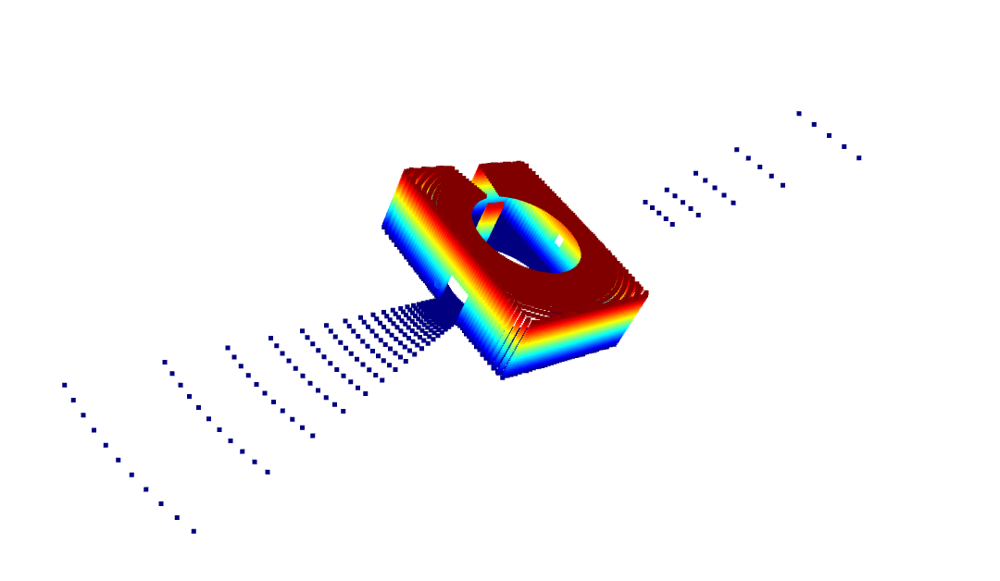
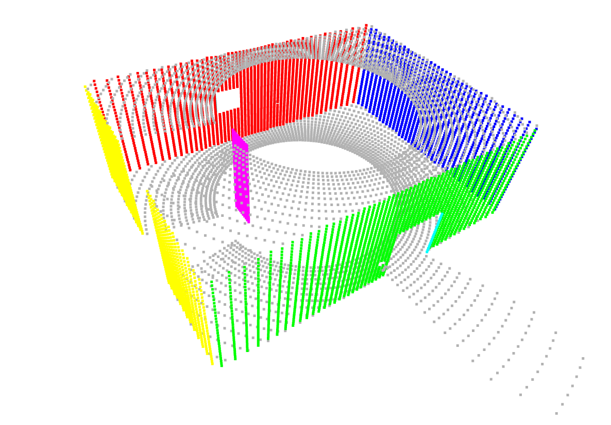
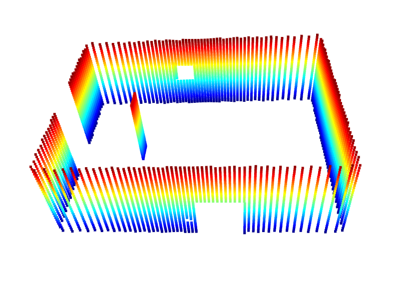
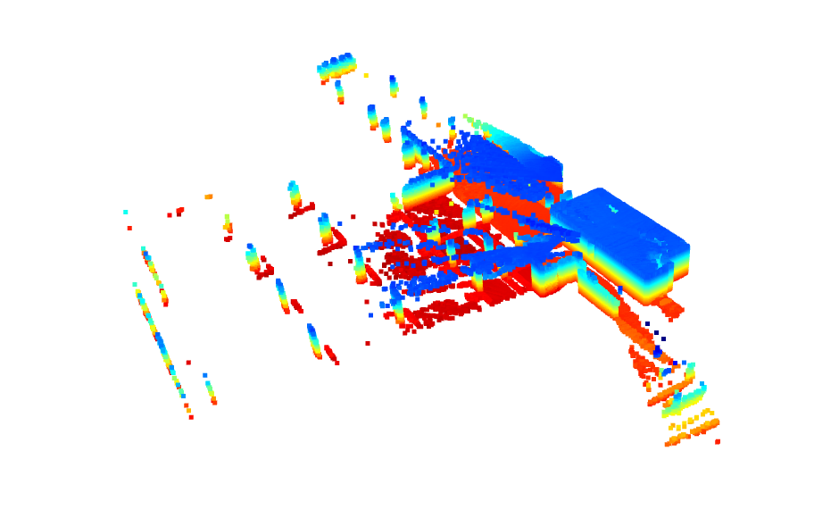
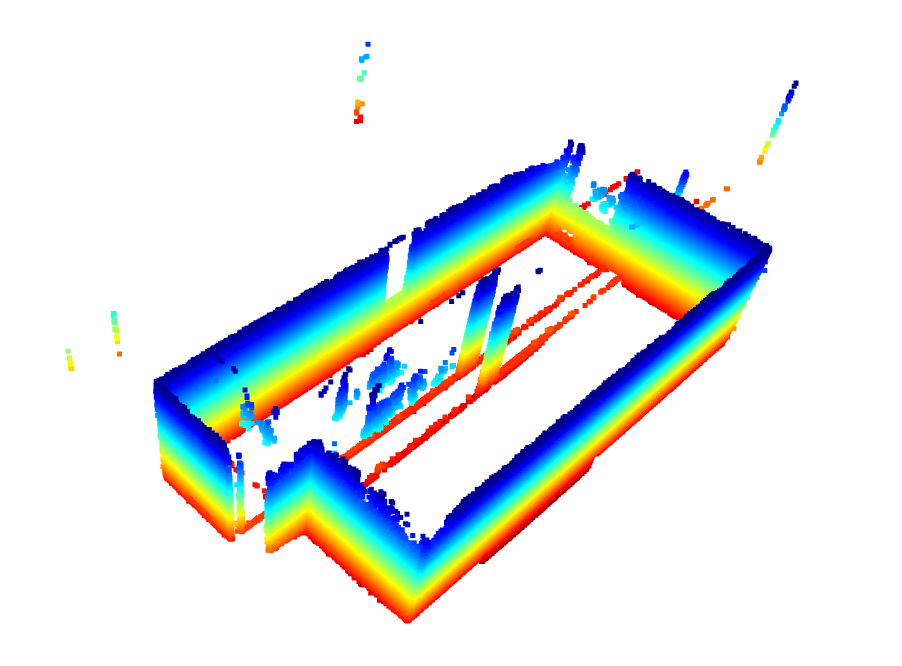

# WallDetectionAssignment

## Overview    
The wall detection solution of this assignment is presented in [wall_detection.py](wall_detection.py).      

The WallDetector class implements a complete pipeline for:     
1. Loading and preprocessing 3D point cloud data

2. Segmenting planes using RANSAC

3. Identifying vertical planes that meet wall criteria

4. Visualizing and saving the results     

The algorithm is designed to work with indoor environment point clouds, typically from LiDAR or depth sensors.    

## Dependencies    
1. Python3.6+
2. numpy
3. matplotlib
4. open3d
5. scipy      

Install all these dependencies using [requirements.txt](requirements.txt) file.     

## Installation     
Clone this repository :   
```bash
git clone https://github.com/ab31mohit/WallDetectionAssignment.git
```     

Install dependencies :    
```bash
cd WallDetectionAssignment
pip3 install -r requirements.txt
```     

## Usage    
Run the [wall_detection.py](wall_detection.py) file with the [pointcloud.pcd](pointcloud.pcd) file as run time argument :   

```bash
python3 wall_detection.py pointcloud.pcd
```   

## Output 
The [wall_detection.py](wall_detection.py) script :

- Prints detection progress to console

- Displays an interactive 3D visualization

- Saves results to wall_detection_results/ directory containing:

    - Individual wall point clouds (wall_1.pcd, wall_2.pcd, etc.)

    - Combined walls point cloud (all_walls_combined.pcd)

    - JSON file with wall metadata (wall_detection_info.json)

## Results  

- ### For [pointcloud.pcd](pointcloud.pcd) file 

    1.  The raw input point cloud data
        <div align="left">
        
        </div>     

    <!-- 2.  The detected walls within the pointcloud data    
        <div align="left">
        
        </div>      -->

    2. Point cloud data of detected walls    
        <div align="left">
        
        </div>       

- ### For [accumulated_pcl_site.pcd](accumulated_pcl_site.pcd) file 

    1.  The raw input point cloud data
        <div align="left">
        
        </div>     

    <!-- 2.  The detected walls within the pointcloud data    
        <div align="left">
        
        </div>      -->

    2. Point cloud data of detected walls    
        <div align="left">
        
        </div>    

## Methodology 

1. Point Cloud Preprocessing :
    - Statistical outlier removal

    - Optional downsampling for dense clouds

2. Plane Segmentation :
    - RANSAC algorithm to find dominant planes

    - Iterative plane removal until no large planes remain

3. Wall Validation :     
Each detected plane is validated against multiple criteria:

    - Verticality Check: Normal vector must be within 15° of vertical

    - Height Check: Minimum height of 1.0 meter

    - Width Check: Minimum width of 0.3 meters

    - Area Check: Minimum area of 0.5 m²

    - Point Count: Minimum of 100 points

4. Dimension Calculation :     
For valid walls, the algorithm calculates:

    - Height (z-range)

    - Width (maximum horizontal extent)

    - Area (using convex hull projection)

    - Plane equation and normal vector     

## Code Structure

The main WallDetector class contains these key methods:

1. Core Methods
    - `load_point_cloud()`: Loads PCD file

    - `preprocess_point_cloud()`: Cleans and prepares data

    - `segment_planes()`: Main RANSAC plane segmentation

    - `detect_walls()`: Complete detection pipeline

2. Validation Methods
    - `is_vertical_plane()`: Checks plane orientation

    - `calculate_plane_dimensions()`: Computes wall dimensions

    - `is_valid_wall()`: Applies all validation criteria

3. Utility Methods
    - `visualize_results()`: 3D visualization with Open3D

    - `save_results()`: Saves walls and metadata

    - `print_summary()`: Console output of results